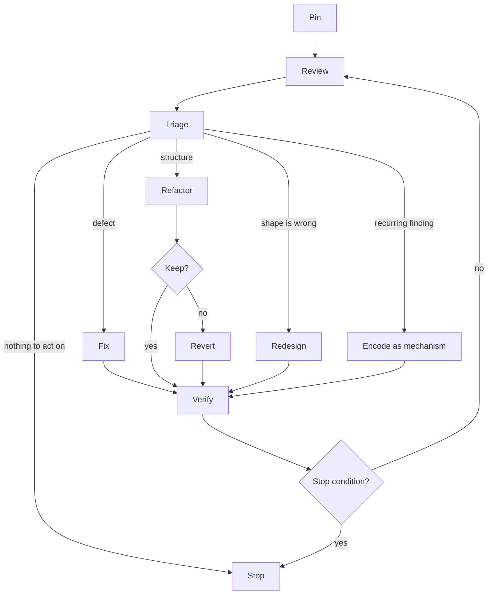

# Research: pstack (poteto)

pstack is a Cursor plugin by Lauren Tan (poteto) that packages one engineer's
working style as skills, playbooks, and subagents. This note records how it
works, how it compares with the `sebnow` plugin in this repository and with the
skills in the author's configs repository
(<https://github.com/sebnow/configs>, `modules/agentic`), and which of its
mechanisms could transfer and what each depends on. The `sebnow` plugin
supersedes the configs skills; they are the author's earlier attempt at
similar workflows.

The research question is automated code quality over time: agents that
iterate on, review, and refactor their own output.

## Sources

- pstack at <https://github.com/cursor/plugins/tree/main/pstack>, commit
  `fae2c6e` of `cursor/plugins`, plugin version 0.15.5. Paths below are
  relative to `pstack/` in that repository.
- Read in full: `pstack/README.md`; `skills/poteto-mode/SKILL.md`; the
  playbooks `refactoring`, `feature`, `bug-fix`, `hillclimb`, `eval`,
  `authoring-a-skill`, `autonomous-run`, `prototype`, `investigation`,
  `multi-phase-plan`, `opening-a-pr`; the skills `interrogate` (with all
  references), `architect` (with all references), `arena`, `swarm`, `reflect`
  (with all references), `tdd`, `no-comments`, `blast-radius`,
  `show-me-your-work`, `figure-it-out`, `create-verification-skill`,
  `maintain-verification-skill`, `recall`; eleven of the 23 principle skills
  (`laziness-protocol`, `minimize-reader-load`, `encode-lessons-in-structure`,
  `prove-it-works`, `test-behavior-not-implementation`,
  `subtract-before-you-add`, `model-the-domain`, `attack-the-premise`,
  `build-the-lever`, `sequence-verifiable-units`, `never-block-on-the-human`);
  the agents `poteto-agent` and `comment-sicko`; the guide pages in
  `docs/guide/` numbered 02, 03, 04, 05, 07, 08, and 10.
- Read in part: `skills/why/SKILL.md`, `skills/how/SKILL.md`,
  `skills/unslop/SKILL.md`, `skills/automate-me/SKILL.md` (two lines found by
  grep). The other principle skills are known only from their one-line
  entries in the `poteto-mode` index.
- Not read: the `benny` automation pack, `teach`, `bro`, `make-bot-ui`,
  `setup-pstack` beyond a grep, the remaining principle skills, the other
  playbooks, and the TypeScript scripts under `skills/poteto-mode/scripts/`.
- Local comparison points: `plugins/skills/` in this repository (skills
  `adr-writing`, `review-code`, `review-writing`, `skill-writing`; agents
  `brain`, `senior`, `junior`, `scout`), and the configs repository at
  commit `ed1edde`: `modules/agentic/skills/` (including `refactor`,
  `review-code`, `council`, `design-architecture`, `coding`, and the first
  60 lines of `design-architecture/references/design-alternatives.md`), the
  agents in `modules/agentic/agents/` (`coder`, `debugger`), the global agent
  instructions in `modules/agentic/agents.md`, the hooks in
  `modules/agentic/hooks/`, and the loop driver in `pkgs/ralph-cc/`.

Nothing in pstack was executed. Statements about how pstack behaves describe
what its text instructs, not observed runs.

## pstack at a glance

The plugin has about 7,500 lines of Markdown:

- `poteto-mode`: the entry point. A 143-line router that lists
  non-negotiable triggers, indexes the principles, sets autonomy rules and
  subagent defaults, prescribes the reply style, and routes to 23 playbooks in
  `skills/poteto-mode/playbooks/`.
- 23 `principle-*` skills, 20 to 40 lines each. Each states one rule, why it
  holds, and a test. `poteto-mode` indexes them and requires the reply to name
  each principle that changed a decision.
- Workflow skills that the playbooks call: `how` and `why` (understanding),
  `architect`, `arena`, `swarm` (design and fan-out), `interrogate`
  (adversarial review), `tdd`, `no-comments`, `unslop`, `technical-writing`
  (cleanup), `show-me-your-work`, `figure-it-out`, `reflect`, `recall`,
  `blast-radius`, and a pair that generates and maintains a project-local
  verification skill.
- Two agents: `poteto-agent`, which reads `poteto-mode` before any work, and
  `Comment Sicko`, a read-only comment reviewer.
- A per-user rule written by `setup-pstack` that maps roles to models (code
  delegates, judgment and prose, review panels). The defaults mix Claude, GPT,
  and Grok models. Several skills rely on cross-vendor diversity.

There is no eval suite for the skills themselves. The only eval material is the
`eval` playbook, which describes how to run a blinded comparison by hand.

## The workflow

### Routing

The user types `/poteto-mode <goal>`. The mode:

1. Matches the goal to a playbook (Bug fix, Feature, Refactoring, Perf,
   Hillclimb, Investigation, Prototype, Autonomous run, and so on). Large or
   unmatched work goes to `figure-it-out`, which designs a bespoke playbook.
2. Opens a todo list whose first items are the playbook's steps, copied
   verbatim. A step it decides not to run stays in the list as
   `skip: <reason>`.
3. Calls other skills as the steps require.
4. Ends every code playbook with "Opening a PR": `/deslop` on the diff,
   `/no-comments` before review, commit bodies and PR description through
   `technical-writing` and `unslop`, small ordered commits, PR opened ready
   rather than draft.

The mode is sticky: once entered, it applies to later turns until the user
opts out.

### A typical Feature run

From `playbooks/feature.md`:

1. `how` over the affected subsystem.
2. `architect`: at least two structurally distinct design sketches produced
   through `arena` on different models, screened against design red flags,
   synthesized into one. By default there is no human checkpoint.
3. A "throughput checkpoint" with four fixed items: blocking first steps,
   independent workstreams, shared mutable state, smallest safe decomposition.
4. Implementation delegated to a subagent with the data shape named up front.
   When several shapes are valid, `arena` runs instead.
5. Verification on the matching surface (UI, CLI, service). "Inconclusive" or
   the wrong surface is not a pass.
6. Rebase into small ordered commits.
7. `interrogate` if the design is contested.
8. "Opening a PR".

### Unattended runs

`playbooks/autonomous-run.md`, `playbooks/hillclimb.md`, and
`skills/figure-it-out/SKILL.md` share one loop:

- State the exit condition as a checkable predicate before the first
  iteration. The guide warns that a duration ("work on this for 4 hours") is
  not a finish condition.
- Each iteration makes the smallest change the evidence justifies, verifies it
  against the predicate on the real artifact, commits it if it advanced, and
  discards it if it did not.
- One row per iteration in a decision log (`show-me-your-work`).
- A plateau means changing approach, not stopping. The predicate is never
  relaxed to end the run. A dead end is written up instead of retried.

Hillclimb adds a frozen measurement harness whose sensitivity is proven first,
a baseline, a regression gate, and a stop predicate that pairs a target with a
minimum number of attempts so an early lucky result cannot end the run.

## Inputs: a goal, not a spec

The guide is explicit (`docs/guide/02-poteto-mode.md`): "You don't write a
spec. You say what's wrong or what you want, plus anything you already know
that saves the agent time." The README adds: "i don't believe in planning. the
best spec is code."

A prompt carries three kinds of content:

- The goal or symptom: "users get two notifications after a retry."
- Constraints that change the playbook's behavior: "repro first", "text
  output stays byte-identical", "zero behavior change, record the current
  output first", "don't change any code yet".
- For unattended work, a contract with four parts (`docs/guide/07-overnight.md`):
  the goal, a done predicate ("zero old callers, all parser fixtures pass, old
  api deleted"), permissions ("don't ask me before committing"), and an escape
  hatch ("if you're truly stuck after a few hours, stop and write up why").

Once the conversation holds the context, prompts shrink to "do it" or
"continue". The guide tells users not to list skills in the prompt, because the
playbook already sequences them.

The one detailed spec in pstack is an output: `playbooks/multi-phase-plan.md`
writes a checklist plan with one section per PR, ten live verification lanes
per PR, a perf gate, and a lint script (`scripts/check-plan.mjs`), and then
waits for the operator's explicit go before any execution.

## How pstack gets information with little mid-task human input

pstack moves human input to the start and the end of the work, and replaces
most mid-task questions with evidence.

### Classify a question before asking it

`poteto-mode/SKILL.md` requires the agent to classify any "which approach" or
"what should this do" question before asking. If the answer is "a fact you
could observe by running something (behavior, timing, layout, output, perf,
even whether an eval separates)", the agent builds a throwaway prototype
(`playbooks/prototype.md`) and lets the observation decide. Only "a genuine
product or preference call no experiment can settle" goes to the human. Under
a full-autonomy grant, the agent applies a default for such a call and reports
it with "the one word that reverses it."

### Mine context instead of requesting it

- `how` explains the current code, fanning out read-only explorers for large
  subsystems.
- `why` reconstructs rationale from `git blame`, commit history, PR bodies and
  review threads, then queries every available MCP source in parallel: issue
  tracker, long-form docs, chat, observability, error tracking, analytics. It
  reports "nobody wrote down why" as a result.
- `recall` rebuilds the user's recent context from their own transcripts plus
  the same shared record.
- `automate-me` drafts a personal mode skill by mining the user's transcripts,
  and asks structured multiple-choice questions only for gaps.
- `reflect`'s tooling reviewer flags each moment the user pasted context the
  agent could have fetched itself, and routes a fix to the skill that owns
  that workflow.

### Proceed, then present

`principle-never-block-on-the-human` states the rule: make the reversible
decision, do the work, show the result, let the human correct it afterwards.
"Product direction comes from the human. Execution should not block."

The human sees the work through:

- The reply, which must name decisions, tradeoffs, and open decisions, and
  carry evidence or a "measured, inferred, or guess" label on every claim.
- The decision log, audited against the transcript at the end of the run, with
  an "Attention" section written by a reviewer on a different model family.
- The PR.
- One-line steering prompts that name a principle: "apply prove it works. show
  me the real output, not the build log."

### Gates that remain

- Irreversible actions: force-push to shared branches, deploys, data deletion,
  customer messages.
- Executing a multi-phase plan: only on the operator's explicit go.
- PRs that change an interaction: the operator reviews screenshots and a video
  before merge.
- `reflect`: skill edits are presented for approval, never applied directly.
- `interrogate`: asks the user when the intent of the change is unclear.
- `architect`: shows the design first only if the user asks for a checkpoint.

"Stakeholders" in pstack means the prompting user plus the written record
reachable through MCPs. No skill interviews anyone. pstack assumes the user
already holds the product intent and can state it as constraints and a
predicate. Where the prompt is silent, the agent picks a default and relies on
the change being cheap to reverse.

## Mechanisms in detail

### Review: `interrogate`

`skills/interrogate/SKILL.md` and its four references.

- Scope, then a one-paragraph statement of intent. Reviewers are told not to
  question the intent, only the execution.
- One reviewer per configured model, all with the same prompt, rubric, and
  code-quality lens. "The adversarial signal comes from model diversity, not
  assigned personas."
- The rubric (`references/rubric.md`) covers correctness, root causes versus
  symptoms, structural integrity, verification, complexity budget, and
  security. It demands traced execution paths rather than "this could be nil".
- The code-quality lens (`references/code-quality-review.md`) asks for "code
  judo": restructurings that make whole branches, helpers, modes, or layers
  disappear. It treats ad-hoc conditionals in unrelated flows as a design
  problem, refuses to approve on correct behavior alone, and lists presumptive
  blockers (a file pushed past 1,000 lines, scattered feature checks,
  pass-through wrappers, logic in the wrong layer).
- The lead judgment (`references/lead-judgment.md`) filters review output
  before anything is acted on. The lead sorts every finding into Act on,
  Consider, Noted, or Dismissed, with a reason for each dismissal. It names
  the common false positives:
  - nitpick gravity: reviewers inflate nits when they find nothing serious;
  - hypothetical versus actual: a null is a finding only if a caller can pass
    one;
  - premature abstraction suggestions;
  - "I would have done it differently".
  More than five Act-on items means the lead is not filtering hard enough. The
  Dismissed list is kept as a trust mechanism so the user can override it.
- `interrogate` does not apply changes itself.

### Refactoring playbook

`skills/poteto-mode/playbooks/refactoring.md`. "You own the contract. The
structure changes. The behavior does not."

1. Pin behavior with a characterization test, snapshot, or equivalence harness
   before anything moves. "Type check and lint are not a pin."
2. Name the missing structure (state machine, typed model, table, reducer).
   The reshape must delete branches or invalid states, not add indirection.
3. Name the target shape as if built today. Run `architect` if it crosses a
   function boundary.
4. Subtract first: dead code, one-caller wrappers, redundant validators. A
   speculative cleanup that "might help" is reverted.
5. Small behavior-preserving steps, each keeping the pin green. API reshapes
   migrate every caller and delete the old API in the same change. No shims.
6. Prove equivalence on the real artifact for larger reshapes: a script that
   diffs old and new outputs, or a recorded baseline replayed.
7. "If the diff does not lower reader load somewhere, revert it."
8. Commits in order: subtraction, reshape, follow-on cleanup.

The reply reports the pin, the equivalence proof, the reader-load change, and
what was reverted.

### Design: `architect` and `arena`

- `architect` runs five phases: A Ground, B Sketch, C Agree (opt-in),
  D Implement, E Scrap. The caller's usage is written first and the types are derived from
  it.
- Sketch runs `arena`: N candidates on different models, each in its own
  worktree, then a judge on a different model family scores them against a
  3 to 6 item rubric. The coordinator reads every candidate, picks a base,
  and grafts the best parts of the others in by hand. Candidates that
  converge on one shape are shipped as that shape without grafting. Wild
  divergence means the framing was underspecified.
- Every candidate is screened against `references/design-red-flags.md`:
  shallow module, information leakage, temporal decomposition, pass-through
  method.
- Scrap lists the signs that the design is wrong: the same workaround in
  unrelated code, escape-hatch types, callers needing to know internal rules,
  two or more implementation deviations of the same shape. On scrap: re-run
  `how`, redesign, make the new sketch smaller than the old one, re-run
  `arena`.

### Verification

- `principle-prove-it-works`: check the real artifact, not a proxy or "it
  compiles". Script the check so a reviewer can rerun it.
- `blast-radius` grades each safety claim on a five-step ladder: you said so;
  you pointed at the line; you showed the bad case cannot happen; you ran it;
  you reproduced it in the running app. It asks for the one fact that makes the
  change safe, proven by running code.
- Bug fixes paste failing-then-passing reproduction output. "Unit tests show
  branch behavior, not bug absence."
- `figure-it-out` uses three verdicts: VERIFIED, NOT VERIFIED, INCONCLUSIVE.
  "Inconclusive is not a pass." When something passes too easily, suspect the
  observation method first.
- `create-verification-skill` generates a project-local skill that launches,
  health-checks, drives, and tears down the real app, with a feature map, and
  must run itself end to end once before it counts as delivered.
- `principle-test-behavior-not-implementation` gives one mechanical check for a
  test: would it still pass if every imported function returned `undefined`?
  If so, rewrite the assertion or delete the test. It lists five shapes that
  fail this check.

### Decision trail: `show-me-your-work`

A TSV with one row per decision (`ts`, `phase`, `decision`, `why`, `evidence`,
`result`), append-only, written by a helper script. At the end of the run the
agent audits its rows against its own transcript and adds superseding rows for
anything wrong or missing. A reviewer on a different model family then reads
the trail and transcript and writes an "Attention" section: weak evidence,
skipped verification, risky choices.

### Learning loop: `reflect`

Three reviewers read the session transcript (judgment, tooling, and a
divergent lens that looks for the less obvious lesson). A synthesizer keeps a
finding only if it passes all of these:

- durable: still true in six months;
- specific enough to recognize, broad enough to recur;
- routed to an existing skill first;
- echoed by two or more reviewers, or clearing a higher bar;
- decision-changing, not just more text;
- routed to the backlog if a lint, script, or runtime check could enforce it;
- aimed at a skill the session actually used (or a description to tune if the
  skill failed to trigger);
- not already covered by the target skill.

Accepted edits wait for user approval.

### Comments: `no-comments` and Comment Sicko

A separate read-only agent deletes comments outside a short keep list (license
headers, public API doc comments, links explaining constraints code cannot
express, behavior forced by an external dependency). A comment explaining a
surprise in the project's own code becomes a `MUST KILL` flag: the fix is a
rename, extraction, or type that makes the comment unnecessary. A comment that
claims a constraint ("do not remove") gets an offer to encode it as a type,
test, or lint. The stated reason for a separate agent: "An author defends its
comments the way you'd defend yours."

### Structure over text: `principle-encode-lessons-in-structure`

When the same instruction is written a second time, turn it into a lint rule,
metadata flag, runtime check, or script, and delete the instruction. Choose the
strongest available mechanism: types that make the bad state
unrepresentable, then a lint or banned
API that fails CI, then a canonical helper, then a runtime check. The stated
reason: agents copy whatever the surrounding code does, so a weak guard becomes
the next template.

## Comparison

| Aspect | pstack | `sebnow` plugin (this repo) | Configs skills |
|---|---|---|---|
| Source of rules | One engineer's style, written as principles | A failure observed and reproduced in an eval | Accumulated practice |
| Skill validation | None shipped; a manual blinded-eval playbook | `claude plugin eval` with a no-skill arm | No eval harness in the tree |
| Size of guidance | ~7,500 lines, one router plus playbooks | ~200 lines of skill text plus agents | ~6,100 lines of skill text |
| Entry | `/poteto-mode <goal>` | `claude --agent sebnow:brain` | Chain: `brainstorm`, `design-architecture`, `blueprint`, `breakdown`, `coder`, `create-pr` |
| Input | Goal plus constraints and a done predicate | A conversation with `brain`; briefs to workers | A plan is required before `coder` writes code |
| Human in the loop | At the start and end; mid-task only for preference calls and irreversible actions | `brain` asks each decision as a question with a recommendation | At every stage; `design-architecture` leaves the decision to the user |
| Delegation | By model strength (code model versus judgment model) | By how much is decided (`junior` spec, `senior` goal, `scout` facts) | `coder` and `debugger` agents |
| Design alternatives | `architect` and `arena`: models compete, a judge scores, base plus grafts | None | `design-alternatives`: agents with different constraints; the user chooses |
| Review | `interrogate`: model diversity, one rubric, lead triage with reasons | `review-code`: one section on code that treats a symptom rather than its cause | `review-code`: one agent per perspective, severity-ranked |
| Review-fix loop | Not inside `interrogate`; playbooks call it before shipping | None | `coder`: fix high findings, behavioral fixes test-first, atomic commits, stop if a fixed finding recurs |
| Refactoring | Executes with a pin, subtraction first, equivalence proof, revert gate | None | `refactor` detects and routes, then asks which candidate |
| Verification | Real artifact, evidence ladder, INCONCLUSIVE is not a pass | Workers report command and output | Build, tests, race detector, lint, formatter must exit 0 |
| Structural enforcement | Stated as a principle | None | Hooks: `gofmt`, `zigfmt`, `mdlint`, `validate-skill`, VCS guards, `block-test-output-filtering` |
| Unattended loop | Predicate, keep or revert, decision log | None | `ralph-cc`: one change per session, stops on `RALPH_DONE` |

### Differences in mechanism

Where the three setups handle the same concern differently:

- **Loop guards.** `coder` stops and escalates when a finding it fixed comes
  back. pstack's closest guards are `principle-attack-the-premise`, which
  fires when two fixes sharing a premise fail the same gate, and writing up a
  dead end instead of retrying. Neither detects a fix undone by the next fix.
- **Where a fix starts.** `coder` sends behavioral review findings through a
  failing test first. pstack's bug-fix playbook does the same for bugs; its
  review step (`interrogate`) leaves fixing to the caller.
- **Reviewer context.** `council` (`modules/agentic/skills/council/SKILL.md`)
  tells each lens agent to gather its own context ("Do not pre-gather context
  for the lenses"), so lenses can surface different facts. `interrogate`
  gives every reviewer the same packaged diff and context, and relies on
  model diversity for independence.
- **Filtering findings.** `coder` fixes findings by the reviewer's own
  severity label. `interrogate` puts a lead, who must give a reason for every
  dismissal, between reviewers and action.
- **Deciding whether a change stays.** pstack's refactoring and hillclimb
  playbooks keep or revert each change on an outcome (pin green, reader load
  lower, metric past noise). `coder`'s Refactor phase has no revert step.
- **When a loop ends.** pstack's unattended playbooks end on a predicate the
  agent checks, on a written-up dead end, or on the escape hatch the prompt
  names. `ralph-cc` ends when the model prints `RALPH_DONE`.
- **What counts as verified.** pstack asks for evidence from the running
  program and grades claims by how they were proven. The configs skills
  require build, test, lint, and formatter commands to exit 0.
- **Enforcement.** The configs repository ships hooks that enforce rules at
  tool-call time. pstack states the principle; of the files read, its only
  linter is `scripts/check-plan.mjs`.
- **Measuring the instructions.** Only the `sebnow` plugin has an eval with a
  no-skill arm. The pstack files read contain no measurement of pstack's
  effect.

## Mechanisms that could transfer

Each entry describes a pstack mechanism and, where the sources say, the
problem it addresses, what it depends on, what it costs, and how its effect
could be measured.

### Lead triage of review findings

**Source:** `skills/interrogate/references/lead-judgment.md`.

**What it is:** a step between reviewers and any fix. Findings go into Act on,
Consider, Noted, or Dismissed, each dismissal with a reason. More than about
five Act-on items is treated as a sign of weak filtering. The lead is told to
look for inflated nits, hypothetical inputs no caller can produce, premature
abstraction suggestions, and "I would have done it differently".

**Addresses:** reviewers that always find something, and fix loops that act on
every finding.

**Depends on:** a lead with more context than the reviewers. The source says
"You have the full conversation context. Use it." In an automated loop the
lead would have whatever the loop driver holds: a brief, a diff, a predicate.

**Costs:** one more model call per review round, and the risk that a lead
dismisses a real finding. The Dismissed list exists so a human can check that.

**Measuring it:** a fixture where review surfaces one real structural issue
and one plausible hypothetical; compare how often each is acted on with and
without the triage step.

**Relation to local pieces:** `coder`'s loop acts on severity alone. The
configs `review-code` has a lighter rule against findings without a concrete
consequence.

### Behavior-pinned refactoring with a revert gate

**Source:** `skills/poteto-mode/playbooks/refactoring.md`.

**What it is:** pin behavior before moving anything, commit deletions before
the reshape, migrate callers and delete the old API in one change, prove
equivalence, revert if reader load did not drop.

**Addresses:** refactors that relocate complexity, and refactors that change
behavior in code that had no tests.

**Depends on:** a way to pin behavior (characterization tests, snapshots,
output diffs) and a way to judge "reader load dropped". pstack defines reader
load (layers to trace, state to hold) but gives no measure, so the judgment
falls to the agent.

**Costs:** writing the pin can exceed the refactor itself on untested code.
Without a measure, the revert gate depends on self-assessment.

**Measuring it:** a fixture with untested code and a tempting layer-adding
move; check whether a pin lands first and whether the move survives.

**Relation to local pieces:** the configs `refactor` skill covers detection
(friction lenses, a catalog of moves) and stops to ask which candidate to
take. The pstack playbook covers execution.

### Predicate-driven loops

**Source:** `playbooks/autonomous-run.md`, `playbooks/hillclimb.md`,
`skills/figure-it-out/SKILL.md`, `docs/guide/07-overnight.md`.

**What it is:** a checkable exit predicate stated before the first iteration;
one change per iteration; keep what advanced the predicate, revert the rest;
never relax the predicate; write up a dead end. Hillclimb adds a frozen
measurement harness, a baseline, and a minimum number of attempts.

**Addresses:** loops that stop on the model's own claim of completion, and
loops that accumulate changes that did not help.

**Depends on:** a predicate that is cheap to run and hard to satisfy
falsely. For structural quality this is the hard part (see Open questions).

**Costs:** each iteration pays for the predicate run; a strict predicate can
stall the loop.

**Relation to local pieces:** in pstack the agent runs the check. `ralph-cc`
runs one session per change from outside the model and stops on the model's
`RALPH_DONE`.

### Classifying questions before asking

**Source:** the Non-negotiables in `skills/poteto-mode/SKILL.md`;
`playbooks/prototype.md`.

**What it is:** before asking the human a question, decide whether its answer
is observable (behavior, timing, output, performance). If it is, run an
experiment. Only questions no experiment can settle go to the human.

**Addresses:** humans asked to decide facts an agent could measure.

**Depends on:** the ability to build throwaway prototypes cheaply.

**Relation to local pieces:** the author's global agent instructions
(`modules/agentic/agents.md` in the configs repository) say "Do not apply
modifications until you have a high confidence in the result" and "If you
can't verify something, say so and ask".

### Recurring findings become mechanisms

**Source:** `skills/principle-encode-lessons-in-structure/SKILL.md`; the
structural-mechanism criterion in `skills/reflect/references/synthesizer.md`.

**What it is:** when the same instruction is written a second time, encode it
as types that make the bad state unrepresentable, a lint or banned API, a
helper, or a runtime check, in that order of strength, and delete the
instruction.

**Addresses:** rules that live in prose and are missed.

**Depends on:** somewhere for the mechanism to run: project linters,
architecture tests, or tool-call hooks such as those in the configs
repository.

**Costs:** a lint that fires on legitimate code is noise; mechanisms need
their own maintenance.

### Transcript mining for skill changes

**Source:** `skills/reflect/` (three reviewer prompts and a synthesizer).

**What it is:** reviewers read a session transcript for mistakes,
corrections, tool quirks, and missed skill triggers. The synthesizer applies
the criteria listed under "Learning loop: `reflect`" above: it keeps durable,
specific, decision-changing findings routed first to an existing skill,
prefers findings echoed by two or more reviewers, requires the target skill to
have been used, rejects duplicates, and routes findings a mechanism could
enforce to a backlog. Edits wait for human approval.

**Addresses:** skill changes written from memory rather than from evidence.

**Relation to local pieces:** the `sebnow` `skill-writing` skill takes an
observed failure as its input. `reflect` produces no eval cases.

### Evidence ladder for verification claims

**Source:** `skills/blast-radius/SKILL.md`.

**What it is:** each claim states how far it was proven: asserted, pointed at
a line, reasoned through, run as a script or test, reproduced in the running
app.

**Addresses:** "tests pass" offered as proof of behavior the tests do not
exercise.

**Relation to local pieces:** the author's global agent instructions
(`modules/agentic/agents.md`) require an **UNVERIFIED:** label on claims that
could not be checked. The ladder distinguishes more levels.

### Competing designs with a judge

**Source:** `skills/architect/`, `skills/arena/SKILL.md`.

**What it is:** several candidates attempt the same design brief
independently, a judge scores them against a rubric, the coordinator picks a
base and grafts parts of the others in. Candidates are screened for design red
flags. A Scrap phase lists signs that a chosen design is failing during
implementation.

**Depends on:** independence between candidates. pstack gets it from
different model vendors. The configs `design-alternatives`
(`modules/agentic/skills/design-architecture/references/design-alternatives.md`)
gets it from giving each agent a different constraint: minimize the
interface, maximize flexibility, optimize for the common caller, isolate a
volatile dependency.

**Who decides:** pstack's coordinator picks and proceeds. The configs
`design-architecture` presents candidates and leaves the choice to the user.

### Smaller mechanisms

- The test check in `principle-test-behavior-not-implementation`: would the
  test still pass if every imported function returned `undefined`? It lists
  five test shapes that fail it.
- The design red flags in `architect/references/design-red-flags.md`: shallow
  module, information leakage, temporal decomposition, pass-through method.
- A separate agent for comment review (`no-comments`, Comment Sicko), on the
  reasoning that an author defends its own comments. The `sebnow`
  `review-writing` skill uses the same reasoning for documents.
- The decision log in `show-me-your-work`: append-only rows, audited against
  the transcript at the end, reviewed by a different model family.

## Parts tied to pstack's context

Some of pstack depends on its environment or its author's preferences:

- **Model diversity.** `interrogate`, `arena`, and the decision-log review use
  Claude, GPT, and Grok models through Cursor. Claude Code can vary the Claude
  model, the prompt, or the context. Whether those give the same independent
  signal is not measured.
- **Autonomy stance.** "Never block on the human" and "just do it" assume
  review happens after the fact. The author's global agent instructions
  (`modules/agentic/agents.md`) ask for high confidence before modifying and
  for questions when something cannot be verified.
- **Always-on process.** `poteto-mode` is a 143-line sticky mode plus 23
  principles, and requires the reply to name the principles applied. That
  naming is self-report. The `eval` playbook grades skills from transcripts
  and code shape.
- **Calibrations.** The 1,000-line file limit, the "about five" Act-on
  threshold, and ten live verification lanes per PR are one engineer's
  numbers.
- **Surface tooling.** Verification on the "matching surface" relies on
  `control-ui` and `control-cli` from the `cursor-team-kit` plugin (named in
  `skills/poteto-mode/SKILL.md` and the README's "not shipped here" list), or
  on a generated verification skill.

## The refactor, redesign, and review loop

### How pstack connects the pieces

pstack has no single loop skill. The pieces call each other through playbook
steps, and the guide's examples start each one with a human prompt:

- **Build, then review.** Feature step 7 runs `interrogate` when the design is
  contested. "Opening a PR" runs `/deslop` and `/no-comments` on every code
  change.
- **Refactor.** The refactoring playbook changes structure against a pinned
  contract and reverts what does not lower reader load. If the cleanup reveals
  a missing feature or a bug, that work is split out and shipped separately. A
  change that alters behavior is a redesign and routes to Feature.
- **Redesign.** The files read show three triggers:
  - `architect` Phase E (Scrap) fires on a pattern of friction during
    implementation: the same workaround in unrelated code, escape-hatch types,
    repeated deviations from the sketch. Scrap leads back to `how`, a smaller
    new sketch, and `arena`.
  - `principle-attack-the-premise` fires when two or more fixes that share one
    premise have failed the same gate. It calls for a census of which actors
    hold the imbalance before the next fix.
  - `principle-redesign-from-first-principles` applies when a new requirement
    arrives (from its entry in the `poteto-mode` index; the skill itself was
    not read).
- **Improvement over time.** Hillclimb loops one metric with keep-or-revert.
  `reflect` turns session transcripts into skill edits.
  `principle-encode-lessons-in-structure` turns repeated instructions into
  mechanisms.

### Stages of a combined loop

The diagram arranges stages drawn from the three sources. No source connects
them this way. In particular, routing each finding from triage to fix,
refactor, redesign, or encode appears in none of them.

**Pin.** pstack: characterization test, snapshot, or equivalence harness
before any move; "type check and lint are not a pin". Configs `coder`: the
full suite must pass before starting.

**Review.** Options in the sources:

- one rubric sent to reviewers on different models (pstack `interrogate`);
- one agent per perspective, such as security or concurrency (configs
  `review-code`);
- lenses that each gather their own context (configs `council`);
- a reviewer in a fresh context that never saw the authoring conversation
  (`sebnow` `review-writing`, for documents).

Lens content in the sources: pstack's rubric and code-quality lens, the
`sebnow` `review-code` section on code that treats a symptom, the design red
flags, the test check.

**Triage.** Configs `coder` acts on the reviewer's severity. pstack's lead
buckets findings and justifies dismissals.

**Fix.** Configs `coder`: failing test first for behavioral findings, direct
edit for the rest, one commit per finding. pstack bug-fix: reproduce first,
paste failing-then-passing output.

**Refactor.** pstack: subtract first, small steps with the pin green, migrate
and delete in one change, equivalence proof, revert gate. Configs `refactor`:
friction lenses and a move catalog for choosing what to refactor, and a
deletion test and compression test for whether a candidate is real.

**Redesign.** Triggers in pstack: the Scrap signs, attack-the-premise, a new
requirement. Ways to produce alternatives: competing models with a judge
(pstack `arena`), agents with different constraints (configs
`design-alternatives`). Who chooses: the coordinator (pstack) or the human
(configs `design-architecture`).

**Encode.** pstack routes findings a mechanism could enforce to a backlog.
The configs repository has hooks that run at tool-call time.

**Verify.** Test-suite exit codes (configs), evidence from the running
program and the evidence ladder (pstack), command and output in the report
(`sebnow` workers).

**Stop conditions in the sources:**

- nothing left to act on (configs `coder`: no high-severity findings);
- the predicate holds, after a minimum number of attempts for hillclimb
  (pstack);
- a fixed finding comes back, so escalate (configs `coder`);
- a dead end, written up (pstack);
- the escape hatch named in the prompt, such as "stuck after a few hours"
  (pstack overnight contract);
- the model prints `RALPH_DONE` (configs `ralph-cc`).

**Outputs in the sources:** ordered commits (pin, subtraction, reshape,
fixes); a decision log; the findings not acted on, for a human; mechanism
candidates in a backlog; transcripts that `reflect` can read.

**Who runs it in each source:** in pstack, the playbooks run inside one agent
that delegates code to subagents. In the configs setup, `coder` runs its own
review loop and `ralph-cc` drives sessions from outside. The `sebnow` plugin
splits decisions (`brain`) from workers (`senior`, `junior`, `scout`).

## Open questions

- Which of these mechanisms change behavior on current models, and which
  describe what models already do? None has been measured with and without.
- How can "structure is simpler" be measured well enough to gate a keep or
  revert? pstack uses reader load without a measure. Candidate proxies
  include net lines, branch count, call depth, and one-caller wrappers; none
  of the sources checks them against maintainability.
- Does a reviewer in a fresh context, or on a different Claude model, find
  what the authoring context misses often enough to justify the cost?
- What does a triage lead need to see to judge findings better than the
  reviewers did?
- Which predicate is cheap enough to run every iteration and strict enough
  that a loop cannot satisfy it with changes that only look better?
- Where should the human sit in an automated quality loop: before redesigns,
  after each loop, at merge, or somewhere else? pstack, the configs skills,
  and the `sebnow` plugin each answer differently.
- How many iterations should a loop run, and how many consecutive reverted
  iterations mean no progress? The files read give a time-based escape hatch
  and hillclimb's minimum attempts, but no iteration cap.
- Can oscillation (a fix undone by the next fix) be detected mechanically,
  for example by comparing findings across iterations?
